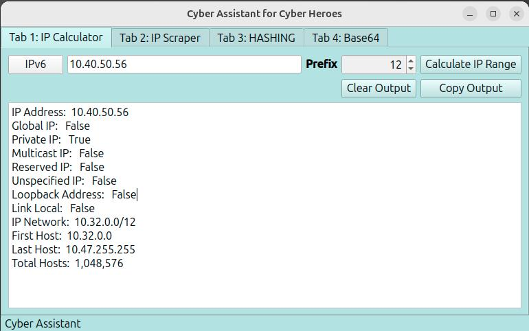
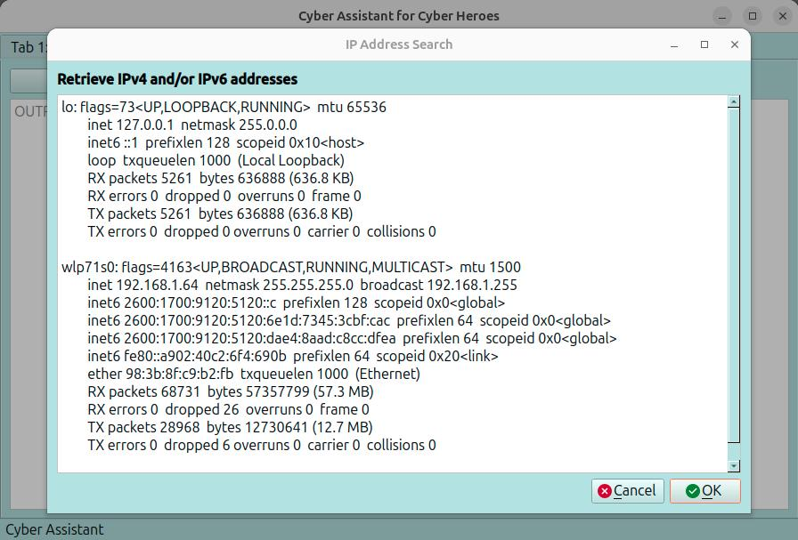
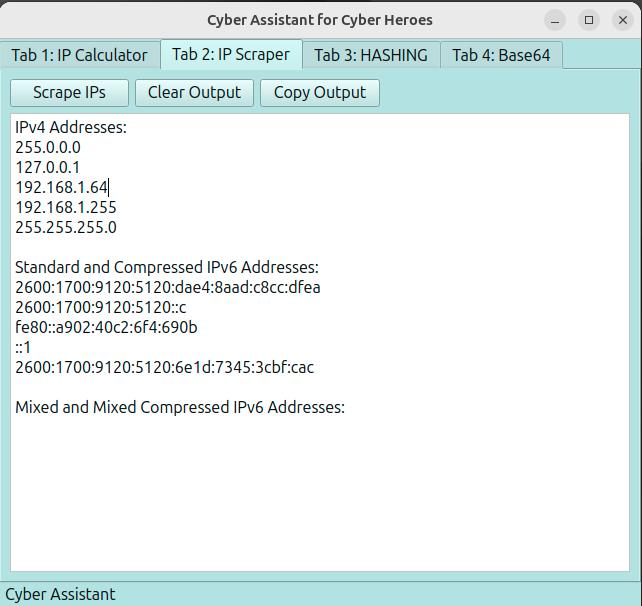
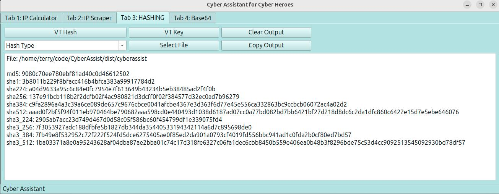
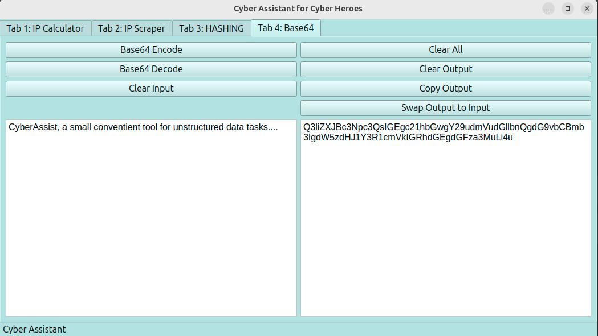

# CyberAssist  
Cyber Analysts need tools. CyberAssist is a deskside tool designed for cyber analysts. Each tab in the gui interface provides powerful capability. The **CyberAssist** release currently features IP Subnetting, IP scraping, base64 encoding/decoding, file hashing and reputational virus total lookups.  

## Coding
All tools are coded with **Python** and **PyQT6**. PyQT6 was selected as a GUI Framework for it's friendly and fast coding attributes and it's performance enhancing and easy to use implementation of PyQT Threads. Additonally, the source code is available for modification per the license thus providing "starter code" with practical examples.

## Cyber Community
I maintain CyberAssist for the Cyber Community in an effort to promote the legal use and sharing of functional cyber security tools. Maintaining a small set of local, trusted tools prevents the download of weaponized trojans and provides underserved cyber analysts with a free, essential resource. It is the intention of this project to assist investigations, promote learning and to improve these tools with community contributions.

## Build
Simply install PyQt6 into your python environment, *pip install PyQt6*. The CyberAssist app may be compiled to run as a single file executable. I recommend "pyinstaller" for creating a single, executable file that runs on Windows environments. The *requirements.txt* file lists the individual PyQt6 packages and versions used. All other imports are Python "*built-ins*" or custom code included with the source. A compiled version of each app will also be provide as a gitHub "release". At this time CyberAssit has been compiled and tested with Windows 10 through 11 and Ubuntu Linux. PyQt6 is cross-platform, so compiling it for MacOS is possible but has not been tested.

## Install pre-compiled images
Just drag the Windows executable to any location and double click. With Linux distributions, you may create an executable shortcut as well. Running the app with "./cyberassist" from the directory it is copied to will work very well.

## License
See https://github.com/thall63/CyberAssist/blob/main/LICENSE

## Cyber Assist Features
- IP Calculator
  - IPv4 subnet calculation includes subnet range, default gateway and a count of the total number of hosts
  - IPv6 subnet calculation includes range the first and last host of the subnet and the total number of hosts
  - User defined network prefix
  - IPv4 and IPv6 calculations include idenfication of global, private, multicast, reserved, unspecified, loopback and link local IP addresses
  - Collapses multiple, contiguous IPv4 subnets into the largest subnet possible
  - Collapses multiple, contingous IPv6 prefixes into the largest possible summary

  

- IP Scraper 
  -Scrapes valid IP Addresses from unstructured text. IP addresses may be both IPv4 and IPv6 within an unstructured text. The scrape functionality considers only "full matches". IP addresses must be separated from other text by at least a single space.

  

  

- HASHING is a file hashing tool
  - Create a hash of any file. Many hash types are available or generate all hashes. Hash types include md5, sha1, sha224, sha256, sha384, sha512, sha3_224, sha3_256, sha3_384, and sha3_512
  - Submit any hash of type md5, sha-1 or sha-256 to Virus Total (Requires Virus Total personal API token)
  - Returns Virus Total reputaion and vendors who have flagged the hash value as malicious
  - User you personal, registered VirusTotal API key

  

-Base64
  - base64 encode and decode text

  

## Coming Soon
- Maybe you will leave comments and tell me!!!
