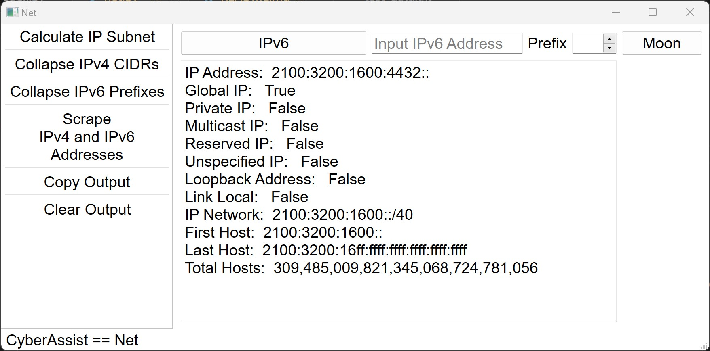
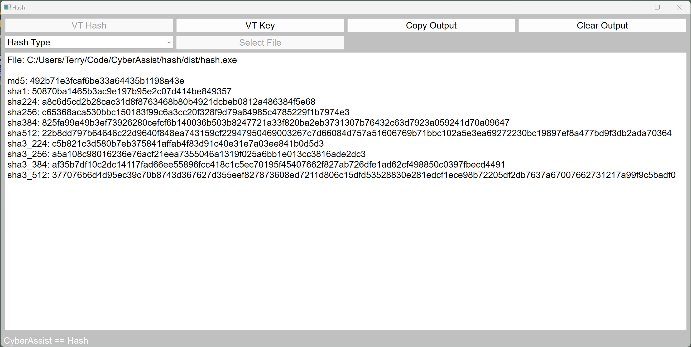

# CyberAssist Project  
Cyber Analysts need tools. The CyberAssist Project is a collection of deskside tools designed for cyber analysts. Each tool is a gui interface with powerful capability. The first **CyberAssist Project** release is "*Net*", an ip subnet helper for those less familair with the practice of IP subnetting.  

## Coding
All tools are coded with **Python** and **PyQT6**. PyQT6 was selected as a GUI Framework for it's friendly and fast coding attributes and it's performance enhancing and easy to use implementation of PyQT Threads.

## Cyber Community
I maintain the Cyber Assist Project for the Cyber Community in an effort to promote the legal use and sharing of functional cyber security tools. Maintaining a small set of local, trusted tools prevents the download of weaponized trojans and provides underserved cyber analysts with a free, essential resource. I am hopeful that your investigations are assisted, learning results from there use and that these tools are improved further by community contributions.

## Install
Simply install PyQt6 into your python environment, *pip install PyQt6*. Each app may be compiled to run as a single file executable. I recommend "pyinstaller" for creating a single "exe" file that runs on Windows environments. The *requirements.txt* file lists the individual PyQt6 packages and versions used. All other imports are Python "*built-ins*". A compiled version of each app will also be provide as a gitHub "release".

## License
See https://github.com/thall63/CyberAssist/blob/main/LICENSE

## Available Apps
- Net
  - Net is an IP subnet calculator with extras
  - IPv4 subnet calculation includes subnet range, default gateway and a count of the total nubmer of hosts
  - IPv6 subnet calculation includes range the first and last host of the subnet and the total number of hosts
  - User defined network prefix
  - IPv4 and IPv6 calculations include idenfication of global, private, multicast, reserved, unspecified, loopback and link local IP addresses
  - Collapses multiple, contiguous IPv4 subnets into the largest subnet possible
  - Collapses multiple, contingous IPv6 prefixes into the largest possible summary
  - Scrapes valid IP Addresses from unstructured text. IP addresses may be both IPv4 and IPv6 within an unstructured text. The scrape functionality considers only "full matches". IP addresses must be separated from other text by at least a single space.

  

-  
  - Hash is a file hashing tool with extras
  - Create a hash of any file. Many hash types are available or generate all hashes. Hash types include md5, sha1, sha224, sha256, sha384, sha512, sha3_224, sha3_256, sha3_384, and sha3_512
  - Submit any hash of type md5, sha-1 or sha-256 to Virus Total (Requires Virus Total personal API token)
  - Returns Virus Total reputaion and vendors who have flagged the hash value as malicious
  
  

## Coming Soon
- Maybe you will leave comments and tell me!!!
